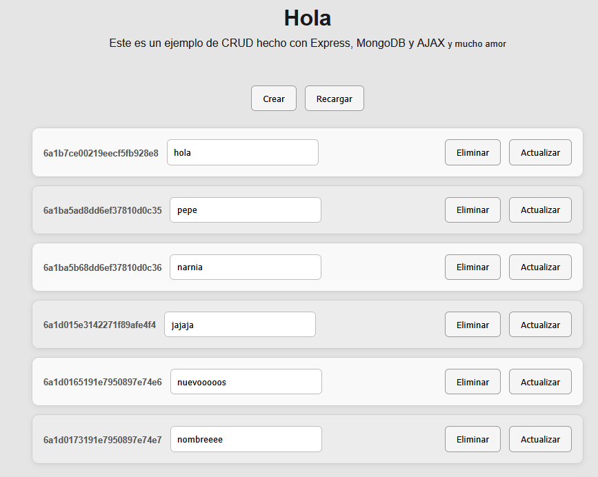

# CRUD de Usuarios con Node.js

Aplicación CRUD desarrollada con Node.js, Express.js, EJS y Mongoose. El proyecto permite gestionar una lista de usuarios mediante operaciones básicas de creación, consulta, actualización y eliminación de registros almacenados en MongoDB.

Al ingresar a la página principal (`index`), el usuario puede visualizar el listado de usuarios registrados y realizar las siguientes operaciones:

- Crear nuevos usuarios.
- Consultar la lista de usuarios existentes.
- Actualizar la información de un usuario.
- Eliminar usuarios del sistema.

Este proyecto sirve como ejemplo práctico de una aplicación web desarrollada con Node.js utilizando el patrón MVC, renderización de vistas con EJS y persistencia de datos mediante MongoDB y Mongoose.

pasos para utilización:

- instalar paquetes
  `npm install`
- arrancar mongo (eso depende de cada sistema)
- inicio de la aplicacion
  `npm run`

cada modificación es recomendable utilizar la linterna:

`npm run lint-fix`

